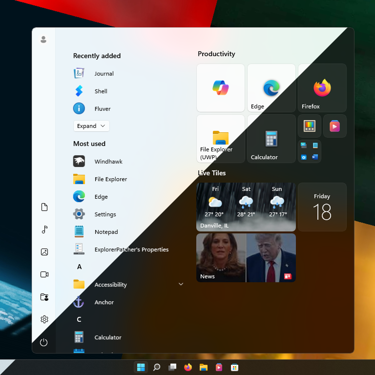
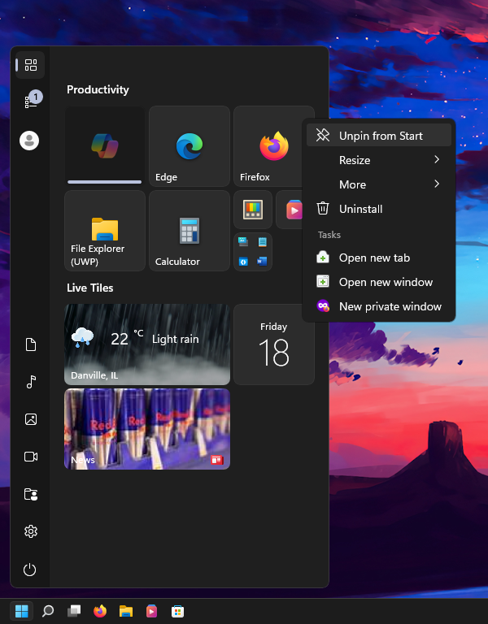
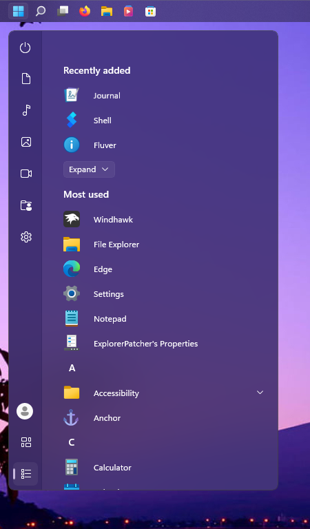
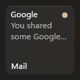
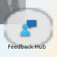

# ModernStartMenu theme for Windows 11 Start Menu Styler (Windows 10 Start menu)

ModernStartMenu is a Fluent start menu theme designed for Windows 10 Start menu on Windows 11.

**Author**: [ndrew6075](https://github.com/ndrew6075)





## Enabling Windows 10 Start menu on Windows 11

If you're already using the Windows 10 Start menu, you can skip this step.

* Install [ExplorerPatcher](https://github.com/valinet/ExplorerPatcher).
* Once installed, open **Properties (ExplorerPatcher)** via the Start menu or right-click the taskbar > **Properties**.
* Go to **Start menu** > **Start menu style** > **Windows 10** > **Restart File Explorer**.


> [!IMPORTANT]
> Set **Corner preference** to **Not rounded**, as ModernStartMenu rounds the Start menu instead of ExplorerPatcher.

## Bugs
* Legacy Windows 10 effects (Reveal and 3D push) are still present.


* Number of unread notifications badge is static.



* Tiles have a broken background when dragged from applist.



* Right-click menus in textbox are not styled correctly.


* Search right-click menu is offset.


## Unsupported configurations/settings
* Windows 10 (partially supported but never fully supported).
* Fullscreen Start menu (ExplorerPatcher).
* High Contrast mode.

## Manual installation

The theme styles have to be imported manually. To do that, follow these steps:

* Open the Windows 11 Start Menu Styler mod in Windhawk.
* Go to the "Settings" tab and select "Textual mode".
* Copy the content below to the text box and click "Save settings".

<details>
<summary>Content to import (click to expand)</summary>

```yaml
styleConstants:
  - background=<WindhawkBlur TintColor="{ThemeResource AcrylicBG}" TintOpacity="0.5" TintLuminosityOpacity="1" FallbackColor="{ThemeResource AcrylicBG}" BlurAmount="35" />
  - accentBG=<WindhawkBlur TintColor="{ThemeResource SystemAccentColorDark2}" TintOpacity="0.75" TintLuminosityOpacity="0.75" FallbackColor="{ThemeResource SystemAccentColorDark2}" BlurAmount="35" />
  - navPane=<SolidColorBrush Color="{ThemeResource NavPane}" />
  - accentNavPane=<SolidColorBrush Color="{ThemeResource SystemAccentColorDark3}" Opacity="0.25"/>
  - borderBrush=<SolidColorBrush Color="{ThemeResource Border}" />
  - tooltipBorderBrush=<SolidColorBrush Color="{ThemeResource TooltipBorder}" />
  - accentButtonNormal=<SolidColorBrush Color="{ThemeResource AccentColor}" />
  - accentButtonPointerOver=<SolidColorBrush Color="{ThemeResource AccentColor}" Opacity="0.9" />
  - accentButtonPressed=<SolidColorBrush Color="{ThemeResource AccentColor}" Opacity="0.8" />
  - accentbuttonBorderBrush=<SolidColorBrush Color="{ThemeResource AccentButtonBorder}" />
  - buttonNormal=<SolidColorBrush Color="{ThemeResource ButtonFillNormal}" />
  - buttonPointerOver=<SolidColorBrush Color="{ThemeResource ButtonFillPointerOver}" />
  - buttonPressed=<SolidColorBrush Color="{ThemeResource ButtonFillPressed}" />
  - buttonBorderBrush=<LinearGradientBrush StartPoint="0.5,0.5" EndPoint="0.5,1"><GradientStop Color="{ThemeResource ButtonBorderBrushTopGradient}" Offset="0.75" /><GradientStop Color="{ThemeResource ButtonBorderBrushBottomGradient}" Offset="1" /></LinearGradientBrush>
  - menuPointerOver=<SolidColorBrush Color="{ThemeResource MenuFillPointerOver}" />
  - menuPressed=<SolidColorBrush Color="{ThemeResource MenuFillPressed}" />
  - listPointerOver=<SolidColorBrush Color="{ThemeResource ListFillPointerOver}" />
  - listPressed=<SolidColorBrush Color="{ThemeResource ListFillPressed}" />
  - tilesPointerOver=<SolidColorBrush Color="{ThemeResource TilesFillPointerOver}" />
  - textboxBorderFocused=<LinearGradientBrush StartPoint="0.5,0.5" EndPoint="0.5,1"><GradientStop Color="{ThemeResource SystemChromeMediumHighColor}" Offset="0.8" /><GradientStop Color="{ThemeResource AccentColor}" Offset="0.9" /></LinearGradientBrush>
  - errorBadge=<SolidColorBrush Color="{ThemeResource ErrorBadge}" />
  - fontFamily=Segoe UI Variable
  - glyph=Segoe Fluent Icons
controlStyles:
  - target: Grid#RootGrid@AcrylicStates > Border#AcrylicBorder
    styles:
      - Background@NormalAcrylic:=$background
      - Background@AccentAcrylic:=$accentBG
      - BorderBrush:=$borderBrush
      - BorderThickness=1
      - CornerRadius=8
  - target: Border#NameTextBlockHost > TextBlock
    styles:
      - FontWeight=SemiBold
      - FontSize=14
      - Margin=3,0,0,-2
  - target: Button > Border > TextBlock
    styles:
      - FontSize=14
      - FontWeight=SemiBold
      - 'Margin={{TextWidth > 14 ? 8 : 16 }},0,0,2'
      - ActualWidth=>TextWidth
  - target: Border#GridPane > * > TileGrid
    styles:
      - Margin=0,24,0,0
  - target: Grid#RootGrid@AcrylicStates > SplitView > Grid > Grid#ContentRoot
    styles:
      - BorderThickness=1,0,0,0
      - BorderBrush@NormalAcrylic:=<SolidColorBrush Color="{ThemeResource NavPaneBorder}" />
      - BorderBrush@AccentAcrylic:=<SolidColorBrush Color="{ThemeResource SystemAccentColorDark3}" Opacity="0.4" />
      - Margin=0,1,0,1
  - target: TextBlock#AppDisplayName
    styles:
      - FontSize=12
      - Margin=20,0,0,0
  - target: TextBlock#DisplayName
    styles:
      - FontSize=12
      - Margin=0,0,0,5
  - target: Grid#RootGrid@AcrylicStates > * > StartUI.NavigationPaneView > StartUI.NavigationPaneGrid
    styles:
      - CornerRadius=8,0,0,8
      - Background@NormalAcrylic:=$navPane
      - Background@AccentAcrylic:=$accentNavPane
      - Margin=1,1,0,1
  - target: StartUI.NavigationPaneView
    styles:
      - UserAccountPictureWidthAndHeight=24
  - target: Grid#VerticalRoot, Button#Header, StartUI.GroupHeaderControl, Grid#RootPanel, StartUI.AllAppsZoomListViewItem
    styles:
      - CornerRadius=6
  - target: Windows.UI.Xaml.Controls.Primitives.RepeatButton#VerticalSmallDecrease > Grid@CommonStates > * > TextBlock
    styles:
      - Text=
      - Foreground@Normal:=<SolidColorBrush Color="{ThemeResource SystemBaseHighColor}" Opacity="0.5" />
      - Foreground@PointerOver:=<SolidColorBrush Color="{ThemeResource SystemBaseHighColor}" Opacity="0.75" />
      - Foreground@Pressed:=<SolidColorBrush Color="{ThemeResource SystemBaseHighColor}" Opacity="0.75" />
      - FontSize@Pressed=6
  - target: Windows.UI.Xaml.Controls.Primitives.RepeatButton#VerticalSmallIncrease > Grid@CommonStates > * > TextBlock
    styles:
      - Text=
      - Foreground@Normal:=<SolidColorBrush Color="{ThemeResource SystemBaseHighColor}" Opacity="0.5" />
      - Foreground@PointerOver:=<SolidColorBrush Color="{ThemeResource SystemBaseHighColor}" Opacity="0.75" />
      - Foreground@Pressed:=<SolidColorBrush Color="{ThemeResource SystemBaseHighColor}" Opacity="0.75" />
      - FontSize@Pressed=6
  - target: Rectangle#ThumbVisual
    styles:
      - Width=6
      - Fill:=<SolidColorBrush Color="{ThemeResource SystemBaseHighColor}" Opacity="0.5" />
      - RadiusX=4
      - RadiusY=4
  - target: MenuFlyoutItem > Grid > TextBlock
    styles:
      - FontSize=14
  - target: Grid#GridForContextMenuInvoke_MustHave_No_Columns_Or_Rows > Grid > TextBlock
    styles:
      - FontSize=14
  - target: ToggleMenuFlyoutItem > Grid > Grid > FontIcon
    styles:
      - Glyph:=&#xE73E;
  - target: Border#UninstallFlyoutPresenterBorder
    styles:
      - MinWidth=376
      - MinHeight=149
      - Background:=<LinearGradientBrush StartPoint="0.5,0" EndPoint="0.5,1"><GradientStop Color="{ThemeResource AcrylicBG}" Offset="0.45" /><GradientStop Color="{ThemeResource DialogBottomPanelBorder}" Offset="0.45" /><GradientStop Color="{ThemeResource DialogBottomPanelBackground}" Offset="0.46" /></LinearGradientBrush>
      - BorderBrush:=$borderBrush
      - CornerRadius=8
  - target: StartUI.UninstallFlyoutControl > StackPanel > TextBlock
    styles:
      - FontSize=14
      - Text=This app and its related information will be removed.
      - Margin=9,8,0,0
  - target: Button#UninstallButton > Grid@CommonStates > ContentPresenter
    styles:
      - Background@Normal:=$accentButtonNormal
      - Background@PointerOver:=$accentButtonPointerOver
      - Background@Pressed:=$accentButtonPressed
      - BorderThickness=0,0,0,1
      - BorderBrush:=$accentbuttonBorderBrush
  - target: Button#UninstallButton > Grid@CommonStates > ContentPresenter > TextBlock
    styles:
      - FontWeight=Normal
      - Foreground:=<SolidColorBrush Color="{ThemeResource SystemAltHighColor}" />
      - Opacity@Pressed=0.75
  - target: Border#Border@CommonStates
    styles:
      - Background@PointerOver:=$listPointerOver
      - Background@Pressed:=$listPressed
      - BorderBrush=Transparent
      - CornerRadius=6
      - Background=Transparent
      - BackgroundTransition:=<BrushTransition Duration="0:0:0.083" />
      - BackgroundSizing=InnerBorderEdge
  - target: StartUI.NavigationPaneButton#PowerButton > ContentPresenter@CommonStates
    styles:
      - Background@PointerOver:=$listPointerOver
      - Background@Pressed:=$listPressed
      - Background=Transparent
      - BorderBrush=Transparent
      - BorderThickness=0
      - BackgroundTransition:=<BrushTransition Duration="0:0:0.083" />
      - BackgroundSizing=InnerBorderEdge
      - CornerRadius=6
  - target: StartUI.NavigationPaneButton#UserTileButton > ContentPresenter@CommonStates
    styles:
      - Background@PointerOver:=$listPointerOver
      - Background@Pressed:=$listPressed
      - Background=Transparent
      - BorderBrush=Transparent
      - BorderThickness=0
      - BackgroundTransition:=<BrushTransition Duration="0:0:0.083" />
      - BackgroundSizing=InnerBorderEdge
      - CornerRadius=6
      - Margin=0,0.5,0,0
  - target: Grid#RootPanel@CommonStates > ContentPresenter
    styles:
      - Background=Transparent
      - BorderBrush=Transparent
      - BorderThickness=0
      - BackgroundTransition:=<BrushTransition Duration="0:0:0.083" />
      - BackgroundSizing=InnerBorderEdge
      - Background@PointerOver:=$listPointerOver
      - Background@Pressed:=$listPressed
      - Background@PressedSelected:=$listPressed
      - Background@PointerOverSelected:=$listPointerOver
      - CornerRadius=6
  - target: Button#PinButton > Grid@CommonStates
    styles:
      - Background@PointerOver:=$menuPointerOver
      - Background@Pressed:=$menuPressed
      - CornerRadius=0,4,4,0
  - target: MenuFlyoutPresenter
    styles:
      - Width=Auto
      - MinWidth=0
      - CornerRadius=8
      - Background:=$background
  - target: JumpViewUI.ItemNotFoundFlyoutControl > StackPanel > TextBlock
    styles:
      - FontSize=15
  - target: StackPanel > Button#DeleteButton > Grid@CommonStates
    styles:
      - Background@Normal:=$buttonNormal
      - Background@PointerOver:=$buttonPointerOver
      - Background@Pressed:=$buttonPressed
      - BorderThickness=1
      - BorderBrush:=$buttonBorderBrush
      - BackgroundTransition:=<BrushTransition Duration="0:0:0.083" />
      - BackgroundSizing=InnerBorderEdge
  - target: StackPanel > Button#DeleteButton > Grid@CommonStates > ContentPresenter > TextBlock
    styles:
      - FontSize=14
      - Opacity@Pressed=0.75
      - Margin=0,-1,0,0
  - target: Button#CancelButton > Grid@CommonStates > ContentPresenter
    styles:
      - Background@Normal:=$accentButtonNormal
      - Background@PointerOver:=$accentButtonPointerOver
      - Background@Pressed:=$accentButtonPressed
      - BorderThickness=0,0,0,1
      - BorderBrush:=$accentbuttonBorderBrush
  - target: Button#CancelButton > Grid@CommonStates > ContentPresenter > TextBlock
    styles:
      - FontSize=14
      - Foreground:=<SolidColorBrush Color="{ThemeResource SystemAltHighColor}" />
      - Opacity@Pressed=0.75
  - target: MenuFlyoutItem > * > Grid > Ellipse
    styles:
      - Width=32
      - Height=32
      - Margin=0,0,0,2
  - target: MenuFlyoutItem > * > Grid > StackPanel > TextBlock#TextBlock
    styles:
      - FontSize=14
      - Margin=8,0,0,1
  - target: MenuFlyoutItem, MenuFlyoutSubItem, ToggleMenuFlyoutItem
    styles:
      - FontFamily=$fontFamily
      - FontSize=14
      - CornerRadius=4
      - Margin=3,0,3,0
      - MinHeight=30
  - target: StackPanel > Button#DeleteButton
    styles:
      - Margin=0,23,10,0
      - CornerRadius=4
      - MinWidth=150
      - Height=32
  - target: Button#CancelButton
    styles:
      - Margin=0,23,0,0
      - CornerRadius=4
      - MinWidth=150
      - Height=32
  - target: StartUI.NavigationPaneBadgeView > Grid
    styles:
      - Margin=-16,-23,0,7
  - target: StartUI.NavigationPaneBadgeView > Grid > Rectangle
    styles:
      - Fill:=$accentButtonNormal
      - Stroke:=$accentButtonNormal
  - target: StartUI.NavigationPaneBadgeView#Badge > Grid > TextBlock
    styles:
      - Foreground:=<SolidColorBrush Color="{ThemeResource SystemAltHighColor}" />
  - target: ItemsStackPanel > StartUI.ViewSelectionListViewItem > Grid@CommonStates
    styles:
      - Background@Selected:=$buttonNormal
      - CornerRadius=6
  - target: Button#PinButton > Grid > Border
    styles:
      - Background=Transparent
      - Canvas.ZIndex=2
      - Height=16
      - Width=44
      - BorderBrush:=$buttonBorderBrush
      - BorderThickness=1,0,0,0
      - CornerRadius=0
  - target: JumpViewUI.JumpListListViewItem
    styles:
      - CornerRadius=4
      - Height=30
  - target: Windows.UI.Xaml.Controls.Primitives.ListViewItemPresenter@CommonStates > * > Border#Background
    styles:
      - Background@Normal:=$buttonNormal
      - Background@PointerOver:=$tilesPointerOver
      - Background@Pressed:=$buttonPressed
      - BorderBrush:=$buttonBorderBrush
      - BorderThickness=1
      - CornerRadius=8
      - BackgroundTransition:=<BrushTransition Duration="0:0:0.083" />
      - BackgroundSizing=InnerBorderEdge
  - target: TileGridNestedPanel > StartUI.TileListViewItem > Windows.UI.Xaml.Controls.Primitives.ListViewItemPresenter
    styles:
      - RevealBackground:=
      - PointerOverBackground:=
      - PressedBackground:=
      - CornerRadius=8
  - target: ToolTip > ContentPresenter
    styles:
      - CornerRadius=4
      - Background:=$background
      - BorderBrush:=$tooltipBorderBrush
      - BorderThickness=1
      - Padding=9,7,9,7
  - target: Button#UninstallButton
    styles:
      - Margin=0,15,9,0
      - MinWidth=159
      - Height=32
      - CornerRadius=4
  - target: StartUI.StartSizingFramePanel@ScreenPosition
    styles:
      - RenderTransform@BottomLeft:=<TranslateTransform X="12" Y="-12" />
      - RenderTransform@TopLeft:=<TranslateTransform X="12" Y="12" />
      - RenderTransform@TopRight:=<TranslateTransform X="-12" Y="12" />
      - CornerRadius=8
  - target: Border#LogoBackgroundPlate
    styles:
      - Margin=12,6,0,6
  - target: MenuFlyoutItem > Grid@CommonStates
    styles:
      - Padding=12,0,12,0
      - MinHeight=30
      - Background@PointerOver:=$menuPointerOver
      - Background@Pressed:=$menuPressed
      - BorderBrush=Transparent
      - Width=Auto
      - MinWidth=0
      - HorizontalAlignment=3
  - target: ToggleMenuFlyoutItem > Grid@CommonStates
    styles:
      - Padding=12,0,12,0
      - Height=28
      - Background@PointerOver:=$menuPointerOver
      - Background@Pressed:=$menuPressed
      - BorderBrush=Transparent
      - Width=Auto
      - MinWidth=0
      - HorizontalAlignment=3
  - target: Button#ShutdownConfirmationButton
    styles:
      - Margin=0,17,0,0
      - MinWidth=150
      - Height=32
      - CornerRadius=4
  - target: Button#ShutdownConfirmationButton > ContentPresenter@CommonStates
    styles:
      - Background@Normal:=$buttonNormal
      - Background@PointerOver:=$buttonPointerOver
      - Background@Pressed:=$buttonPressed
      - BorderThickness=1
      - BorderBrush:=$buttonBorderBrush
      - BackgroundTransition:=<BrushTransition Duration="0:0:0.083" />
      - BackgroundSizing=InnerBorderEdge
  - target: TextBox > Grid > Button#DeleteButton > Grid@CommonStates
    styles:
      - Background@PointerOver:=$listPointerOver
      - CornerRadius=4
      - Height=20
      - Width=28
      - Margin=-12,0,0,0
      - Background@Pressed:=$listPressed
  - target: Grid#InnerRoot
    styles:
      - Height=46
  - target: TextBlock#SignedInStatus
    styles:
      - FontSize=12
      - Margin=8,0,0,2
  - target: MenuFlyoutSeparator
    styles:
      - Background:=$buttonBorderBrush
      - Padding=1,4,1,4
  - target: Grid#RootPanel@CommonStates > Rectangle
    styles:
      - Fill@Selected:=$accentButtonNormal
      - Height=16
      - Width=3
      - RadiusX=2
      - RadiusY=2
      - Canvas.ZIndex=5
      - Fill@PressedSelected:=$accentButtonNormal
      - Fill@PointerOverSelected:=$accentButtonNormal
  - target: StartUI.NavigationPaneButton#UserTileButton
    styles:
      - Margin=6
      - Height=34
      - CornerRadius=6
  - target: StartUI.NavigationPaneButton#PowerButton
    styles:
      - Margin=6,6.5,6,5
      - Height=34
      - CornerRadius=6
  - target: StartUI.ViewSelectionListViewItem
    styles:
      - Margin=6
      - Height=34
      - CornerRadius=6
  - target: StartUI.AppListViewItem
    styles:
      - Margin=6
      - Height=34
      - CornerRadius=6
  - target: StartUI.AppListViewItem > Grid#RootPanel@CommonStates > * > FontIcon
    styles:
      - Margin=-12,0,0,0
      - Opacity@Pressed=0.75
  - target: StartUI.NavigationPaneButton#PowerButton > ContentPresenter@CommonStates > * > FontIcon
    styles:
      - Margin=-12,0,0,0
      - Opacity@Pressed=0.75
  - target: StartUI.NavigationPaneButton#UserTileButton > ContentPresenter@CommonStates > StartUI.NavigationPaneItemPanel > Grid
    styles:
      - Margin=-13,0,0,0
      - Opacity@Pressed=0.75
  - target: JumpViewUI.JumpListCategoryHeaderControl > Grid > TextBlock#HeadingTextBlock
    styles:
      - Margin=15,9,0,5
  - target: MenuFlyoutSubItem > Grid@CommonStates
    styles:
      - Background@SubMenuOpened:=$menuPointerOver
      - Background@PointerOver:=$menuPointerOver
      - BorderBrush=Transparent
      - Padding=12,0,12,0
      - Width=Auto
      - MinWidth=0
      - HorizontalAlignment=3
  - target: Viewbox > Border > TextBlock
    styles:
      - FontWeight=SemiBold
      - Margin=0,0,0,4
  - target: TextBlock#FolderDisplayName
    styles:
      - Margin=9,0,0,5
  - target: JumpViewUI.JumpListListViewItem > Grid@CommonStates
    styles:
      - Background@PointerOver:=$menuPointerOver
      - Background@Pressed:=$menuPressed
      - BorderBrush=Transparent
      - Padding=0,0,12,0
      - Width=Auto
      - MinWidth=0
      - HorizontalAlignment=3
  - target: Button#PinButton
    styles:
      - Width=44
      - Margin=12,0,-12,0
  - target: Button#PinButton > Grid@CommonStates > * > TextBlock
    styles:
      - Margin=1,-2,0,0
      - Opacity@Pressed=0.75
      - Transitions:=<TransitionCollection><EntranceThemeTransition IsStaggeringEnabled="True" FromHorizontalOffset="-25" FromVerticalOffset="0" /></TransitionCollection>
  - target: FontIcon#SubItemChevron
    styles:
      - Glyph:=&#xE76C;
  - target: Border#SmallLogo
    styles:
      - Margin=0,0,0,4
  - target: MenuFlyoutPresenter > Grid > ScrollViewer > Border
    styles:
      - ChildTransitions:=<TransitionCollection><EntranceThemeTransition IsStaggeringEnabled="True" FromHorizontalOffset="-25" FromVerticalOffset="0" /></TransitionCollection>
  - target: ToolTip > ContentPresenter > TextBlock
    styles:
      - Padding=0,0,0,1
  - target: Button#ShutdownReasonButton
    styles:
      - MinWidth=150
      - Height=32
      - CornerRadius=4
  - target: Button#ShutdownReasonButton > ContentPresenter@CommonStates
    styles:
      - Background@Normal:=$buttonNormal
      - Background@PointerOver:=$buttonPointerOver
      - Background@Pressed:=$buttonPressed
      - BorderThickness=1
      - BorderBrush:=$buttonBorderBrush
      - BackgroundTransition:=<BrushTransition Duration="0:0:0.083" />
      - BackgroundSizing=InnerBorderEdge
  - target: ComboBox#ShutdownReasonComboBox
    styles:
      - CornerRadius=4
      - MinWidth=166
      - FontFamily=$fontFamily
  - target: ComboBox > Grid@CommonStates > Border#Background
    styles:
      - Background@Normal:=$buttonNormal
      - Background@PointerOver:=$buttonPointerOver
      - Background@Pressed:=$buttonPressed
      - CornerRadius=4
      - BorderThickness=1
      - BorderBrush:=$buttonBorderBrush
      - BackgroundTransition:=<BrushTransition Duration="0:0:0.083" />
      - BackgroundSizing=InnerBorderEdge
  - target: ComboBoxItem
    styles:
      - CornerRadius=4
      - Margin=3,0,3,0
  - target: ComboBoxItem > Grid@CommonStates
    styles:
      - Background@PointerOver:=$menuPointerOver
      - Background@Pressed:=$menuPressed
      - Background@Selected:=$menuPointerOver
      - Background@SelectedPressed:=$menuPressed
      - Background@SelectedPointerOver:=$menuPointerOver
      - BorderBrush=Transparent
  - target: FlyoutPresenter
    styles:
      - CornerRadius=8
      - Background:=$background
      - BorderBrush:=$borderBrush
      - Padding=16
  - target: StackPanel#ShutdownConfirmationFlyoutPanel
    styles:
      - Margin=0,-1.5,0,0
  - target: StackPanel#ShutdownReasonFlyoutPanel
    styles:
      - Margin=0,-3,0,0
  - target: Button#ShutdownConfirmationButton > ContentPresenter@CommonStates > TextBlock
    styles:
      - FontSize=14
      - Opacity@Pressed=0.75
      - Foreground:=<SolidColorBrush Color="{ThemeResource SystemBaseHighColor}" />
  - target: Button#ShutdownReasonButton > ContentPresenter@CommonStates > TextBlock
    styles:
      - FontSize=14
      - Opacity@Pressed=0.75
      - Foreground:=<SolidColorBrush Color="{ThemeResource SystemBaseHighColor}" />
  - target: ComboBox > Grid@CommonStates > ContentPresenter > TextBlock
    styles:
      - FontSize=14
      - Opacity@Pressed=0.75
      - Foreground:=<SolidColorBrush Color="{ThemeResource SystemBaseHighColor}" />
  - target: ComboBoxItem > Grid@CommonStates > ContentPresenter > TextBlock
    styles:
      - FontSize=14
      - Opacity@Pressed=0.75
      - Foreground:=<SolidColorBrush Color="{ThemeResource SystemBaseHighColor}" />
      - Margin=0,1,0,-1
  - target: TextBlock#FolderGlyph
    styles:
      - FontSize=11
      - FontWeight=Light
  - target: ItemsWrapGrid > StartUI.AllAppsZoomListViewItem > Windows.UI.Xaml.Controls.Primitives.ListViewItemPresenter > Border > TextBlock
    styles:
      - FontWeight=Light
      - Margin=1,2,0,0
  - target: TextBox > Grid > Border#BackgroundElement
    styles:
      - Background:=<SolidColorBrush Color="{ThemeResource TextBoxBG}" Opacity="0.75" />
      - CornerRadius=4
  - target: TextBox > Grid > Border#BorderElement
    styles:
      - BorderThickness=1,1,1,2
      - CornerRadius=4
      - BorderBrush:=$textboxBorderFocused
      - Margin=2
  - target: Grid#MainGrid@InteractionStates > Rectangle#BackgroundElement
    styles:
      - Fill@InteractionState_Edit:=
      - Fill@InteractionState_Rest:=
      - Fill@InteractionState_Pressed:=
      - Fill@InteractionState_Drag:=
      - StrokeThickness=0
      - RadiusX=4
      - RadiusY=4
  - target: Grid#MainGrid@FocusStates > Rectangle#BackgroundElement
    styles:
      - Fill@FocusState_Hover:=$buttonNormal
      - Fill@FocusState_None=Transparent
      - Fill@FocusState_HoverPlaceholder:=$buttonNormal
      - StrokeThickness=0
      - Fill@FocusState_Keyboard:=$buttonNormal
      - RadiusX=4
      - RadiusY=4
      - Margin=0,2,50,2
      - MinWidth=258
  - target: StackPanel > Button#DeleteButton > Grid > ContentPresenter
    styles:
      - BorderBrush=Transparent
  - target: FontIcon
    styles:
      - FontFamily=$glyph
      - Foreground:=<SolidColorBrush Color="{ThemeResource SystemBaseHighColor}" />
  - target: Border#NameTextBoxHost > TextBox
    styles:
      - Margin=-2,0,0,2
      - FontWeight=Semibold
      - FontSize=14
      - FontFamily=$fontFamily
  - target: SplitView#RootContent
    styles:
      - IsPaneOpen=False
      - OpenPaneLength=48
  - target: Grid#RootGrid@AcrylicStates > * > StartUI.NavigationPaneView > StartUI.NavigationPaneGrid > Border
    styles:
      - Background@NormalAcrylic:=$background
      - Background@AccentAcrylic:=$accentBG
      - Width=48
  - target: Windows.UI.Xaml.Controls.Primitives.ListViewItemPresenter > Grid > ProgressBar
    styles:
      - CornerRadius=2
      - Margin=20,0,4,4
  - target: Windows.UI.Xaml.Controls.Primitives.ListViewItemPresenter > Grid > ProgressBar > * > Rectangle
    styles:
      - Fill:=$accentButtonNormal
      - Margin=-1,-2,0,-2
      - RadiusX=4
      - RadiusY=4
  - target: TextBox > Grid > Button#DeleteButton > Grid@CommonStates > Border > TextBlock#GlyphElement
    styles:
      - Foreground:=<SolidColorBrush Color="{ThemeResource SystemBaseHighColor}" />
      - Margin=0,1,0,0
      - Opacity@Pressed=0.75
  - target: ScrollViewer#ContentElement
    styles:
      - Foreground:=<SolidColorBrush Color="{ThemeResource SystemBaseHighColor}" />
      - Margin=5,0,0,1
      - FontFamily=Segoe UI Variable Small
  - target: Windows.UI.Xaml.Controls.Primitives.ListViewItemPresenter > Grid > ProgressBar > Grid > Border
    styles:
      - BorderThickness=1
      - Background:=<SolidColorBrush Color="{ThemeResource SystemChromeHighColor}" Opacity="0.5" />
  - target: StartUI.StartSizingFramePanel@ScreenPosition > * > StartUI.ViewSelectionListView
    styles:
      - Grid.Row@BottomLeft=0
      - Grid.Row@TopLeft=5
      - Grid.Row@TopRight=5
  - target: StartUI.StartSizingFramePanel@ScreenPosition > * > StartUI.UserTileView
    styles:
      - Grid.Row@BottomLeft=1
      - Grid.Row@TopLeft=4
      - Grid.Row@TopRight=4
  - target: StartUI.StartSizingFramePanel@ScreenPosition > * > StartUI.PowerOptionsView
    styles:
      - Grid.Row@BottomLeft=5
      - Grid.Row@TopLeft=0
      - Grid.Row@TopRight=0
  - target: StartUI.StartSizingFramePanel@ScreenPosition > * > StartUI.AppListView
    styles:
      - Grid.Row@BottomLeft=4
      - Grid.Row@TopLeft=1
      - Grid.Row@TopRight=1
  - target: Border#HighlightBackground
    styles:
      - Background:=$menuPointerOver
      - Margin=-2
      - CornerRadius=6
      - BorderBrush:=<SolidColorBrush Color="{ThemeResource SystemBaseHighColor}" />
  - target: Button#DeleteButton > Grid > Border
    styles:
      - Background=Transparent
  - target: StartUI.TileFolderNameTextBox > Grid@CommonStates > Border#BorderElement
    styles:
      - Background@PointerOver:=$buttonNormal
      - Background@Focused:=<SolidColorBrush Color="{ThemeResource TextBoxBG}" Opacity="0.75" />
      - BorderThickness@PointerOver=1,1,1,0
      - BorderThickness@Focused=0
      - BorderBrush@PointerOver:=$buttonNormal
      - CornerRadius=4
      - Height=28
  - target: StartUI.TileFolderNameTextBox > Grid@CommonStates
    styles:
      - BorderThickness@PointerOver=0
      - BorderThickness@Focused=1,1,1,2
      - BorderBrush@PointerOver=Transparent
      - BorderBrush@Focused:=$textboxBorderFocused
      - CornerRadius=4
      - Height=28
  - target: Border#DeleteButtonWrapper > Button#DeleteButton > Grid@CommonStates
    styles:
      - Background@PointerOver:=$buttonPointerOver
      - Background@Pressed:=$buttonPressed
      - CornerRadius=4
      - Width=28
      - Height=20
      - Margin=-6,1,0,0
  - target: Border#DeleteButtonWrapper > Button#DeleteButton > Grid@CommonStates > Border > TextBlock#GlyphElement
    styles:
      - Foreground:=<SolidColorBrush Color="{ThemeResource SystemBaseHighColor}" />
      - Margin=0,1,0,0
      - Opacity@Pressed=0.75
  - target: Windows.UI.Xaml.Controls.Primitives.RepeatButton#VerticalSmallIncrease > Grid, Windows.UI.Xaml.Controls.Primitives.RepeatButton#VerticalSmallDecrease > Grid
    styles:
      - Background=Transparent
  - target: StartUI.TileFolderNameTextBox > Grid@CommonStates > Border > TextBlock#PlaceholderTextContentPresenter
    styles:
      - FontWeight=SemiBold
      - FontSize=14
      - Margin=2,-3,0,0
      - Opacity@Normal=0
      - Opacity@PointerOver=1
      - Opacity@Focused=0
  - target: ScrollBar > Grid > Grid > Rectangle
    styles:
      - Fill:=<SolidColorBrush Color="{ThemeResource SystemChromeHighColor}" Opacity="0.2" />
      - RadiusX=4
      - RadiusY=4
  - target: Rectangle#Overlay, Border#OverlayBorder
    styles:
      - Opacity=0.5
  - target: StartUI.TileViewControl > Grid#MainGrid > Grid > ProgressBar
    styles:
      - CornerRadius=2
      - Margin=4
  - target: StartUI.TileViewControl > Grid#MainGrid > Grid > ProgressBar > * > Rectangle
    styles:
      - Margin=-1,-2,0,-2
      - Fill:=$accentButtonNormal
      - RadiusX=4
      - RadiusY=4
  - target: StartUI.TileViewControl > Grid#MainGrid > Grid > ProgressBar > Grid > Border
    styles:
      - BorderThickness=1
      - Background:=<SolidColorBrush Color="{ThemeResource SystemChromeHighColor}" Opacity="0.5" />
  - target: StartUI.ViewSelectionListViewItem > Grid#RootPanel@CommonStates > ContentPresenter > StartUI.NavigationPaneItemPanel > FontIcon
    styles:
      - Margin=-12,0,0,0
      - Opacity@Pressed=0.75
      - Opacity@PressedSelected=0.75
  - target: StartUI.GroupHeaderControl > Grid > Rectangle
    styles:
      - RadiusX=4
      - RadiusY=4
  - target: TextBlock#StatusMessage[Text=System], StartUI.ExpandCollapseButton, Rectangle#Small_Tile_Overlay
    styles:
      - Visibility=1
  - target: TextBlock#StatusMessage
    styles:
      - Margin=20,0,0,0
      - FontSize=12
      - Foreground:=$accentButtonNormal
  - target: TextBlock#ExpandCollapseButtonText
    styles:
      - Margin=8,0,2,2
      - FontSize=12
  - target: ComboBox > Grid@CommonStates > FontIcon#DropDownGlyph
    styles:
      - Opacity@Pressed=0.75
      - Foreground:=<SolidColorBrush Color="{ThemeResource SystemBaseHighColor}" />
  - target: JumpViewUI.ControlHostMenuFlyoutPresenter
    styles:
      - Background:=<LinearGradientBrush StartPoint="0,0.5" EndPoint="0,1"><GradientStop Color="{ThemeResource AcrylicBG}" Offset="0.275" /><GradientStop Color="{ThemeResource DialogBottomPanelBorder}" Offset="0.275" /><GradientStop Color="{ThemeResource DialogBottomPanelBackground}" Offset="0.285" /></LinearGradientBrush>
      - BorderBrush:=$borderBrush
      - MinHeight=189
  - target: StartUI.AllAppsGridListViewItem, StartUI.AllAppsGridListViewItem > ContentPresenter > Grid > TileGridNestedPanel > StartUI.AllAppsGridListViewItem
    styles:
      - CornerRadius=6
      - Width=Auto
      - MinWidth=0
      - HorizontalAlignment=3
  - target: StartUI.AllAppsGridListViewItem > Windows.UI.Xaml.Controls.Primitives.ListViewItemPresenter
    styles:
      - PointerOverBackground:=
      - PressedBackground:=
      - RevealBorderBrush=Transparent
      - RevealBackground:=
      - Width=Auto
      - MinWidth=0
      - HorizontalAlignment=3
  - target: StartUI.AllAppsPane
    styles:
      - Margin=12,0,0,0
      - FontWeight=SemiBold
  - target: StartUI.AllAppsGridListView > * > ItemsPresenter
    styles:
      - Margin=0,32,0,0
  - target: StartUI.AllAppsGridListViewItem > Windows.UI.Xaml.Controls.Primitives.ListViewItemPresenter@CommonStates > Grid
    styles:
      - CornerRadius=6
      - Background@Normal=Transparent
      - Background@PointerOver:=$listPointerOver
      - Background@Pressed:=$listPressed
      - BackgroundTransition:=<BrushTransition Duration="0:0:0.083" />
      - BackgroundSizing=InnerBorderEdge
      - BorderBrush=Transparent
      - Width=Auto
      - MinWidth=0
      - HorizontalAlignment=3
  - target: StartUI.AllAppsGridListViewItem[AutomationProperties.AutomationId=ExpandCollapseButton]
    styles:
      - CornerRadius=4
      - MinWidth=0
      - MinHeight=0
      - HorizontalAlignment=0
      - VerticalAlignment=1
      - Margin=12,0,0,0
  - target: StartUI.AllAppsGridListViewItem > Windows.UI.Xaml.Controls.Primitives.ListViewItemPresenter@CommonStates > StackPanel
    styles:
      - CornerRadius=4
      - Background@Normal:=$buttonNormal
      - Background@PointerOver:=$buttonPointerOver
      - Background@Pressed:=$buttonPressed
      - BackgroundTransition:=<BrushTransition Duration="0:0:0.083" />
      - BackgroundSizing=InnerBorderEdge
      - BorderBrush:=$buttonBorderBrush
      - BorderThickness=1
      - Width=Auto
      - Height=24
      - MinWidth=0
      - HorizontalAlignment=0
      - VerticalAlignment=1
  - target: StartUI.AllAppsZoomListViewItem > Windows.UI.Xaml.Controls.Primitives.ListViewItemPresenter
    styles:
      - PointerOverBackground:=
      - PressedBackground:=
      - RevealBorderBrush=Transparent
      - RevealBackground:=
  - target: StartUI.AllAppsZoomListViewItem > Windows.UI.Xaml.Controls.Primitives.ListViewItemPresenter@CommonStates > Border, StartUI.AllAppsZoomListViewItem > Windows.UI.Xaml.Controls.Primitives.ListViewItemPresenter@CommonStates > Viewbox > Border
    styles:
      - CornerRadius=6
      - Background@Normal=Transparent
      - Background@PointerOver:=$listPointerOver
      - Background@Pressed:=$listPressed
      - BackgroundTransition:=<BrushTransition Duration="0:0:0.083" />
      - BackgroundSizing=InnerBorderEdge
      - BorderBrush=Transparent
      - MinWidth=46
      - MinHeight=46
  - target: StartUI.TileFolderNameTextBox > Grid@CommonStates > Border > ScrollViewer
    styles:
      - Margin@Normal=3,-4,0,0
      - Margin@PointerOver=3,-4,0,0
      - Margin@Focused=2,-5,0,0
      - FontFamily=Segoe UI Variable Display
      - FontSize=14
      - FontWeight=SemiBold
  - target: Grid#LogoOverlay
    styles:
      - Margin=12,6,0,6
      - Opacity=0.5
  - target: FontIcon#IconOverlay, FontIcon#WindowsUpdatePendingReminder
    styles:
      - Foreground=#FF9900
  - target: TextBlock#ErrorBadge
    styles:
      - Text=
      - FontSize=14
      - Foreground:=$errorBadge
      - VerticalAlignment=0
      - Margin=0,8,0,0
  - target: TextBlock#Badge, TextBlock#Incoming_Badge
    styles:
      - Text=
      - FontSize=12
      - Foreground:=$accentButtonNormal
      - VerticalAlignment=0
      - Margin=0,8,0,0
  - target: FontIcon#CheckGlyph
    styles:
      - Glyph:=&#xE73E;
  - target: TextBlock
    styles:
      - FontFamily=Segoe UI Variable, Segoe Fluent Icons
  - target: FontIcon > Grid > TextBlock
    styles:
      - FontFamily=Segoe Fluent Icons
  - target:  StartUI.AllAppsGridListViewItem > ContentPresenter > Grid > TileGridNestedPanel > StartUI.AllAppsGridListViewItem, StartUI.AllAppsGridListViewItem > ContentPresenter > Grid > TileGridNestedPanel > StartUI.AllAppsGridListViewItem > Windows.UI.Xaml.Controls.Primitives.ListViewItemPresenter, StartUI.AllAppsGridListViewItem > ContentPresenter > Grid > TileGridNestedPanel > StartUI.AllAppsGridListViewItem > Windows.UI.Xaml.Controls.Primitives.ListViewItemPresenter@CommonStates > Grid
    styles:
      - Margin=4,0,0,0
  - target: Border#PopupBorder
    styles:
      - Background:=$background
      - CornerRadius=8
  - target: TextBlock#ShutdownNoChoicesTextBlock
    styles:
      - Margin=0,0,0,1
  - target: Border#GlideAnimationContainer
    styles:
      - CornerRadius=8
  - target: Grid#FlipAnimationContainer
    styles:
      - CornerRadius=8
themeResourceVariables:
  - AccentColor@Dark={ThemeResource SystemAccentColorLight2}
  - AccentColor@Light={ThemeResource SystemAccentColorDark1}
  - AccentButtonBorder@Dark={ThemeResource SystemAccentColorLight1}
  - AccentButtonBorder@Light={ThemeResource SystemAccentColorDark2}
  - ErrorBadge@Dark=#FF99A4
  - ErrorBadge@Light=#C42B1C
  - ButtonFillNormal@Dark=#0FFFFFFF
  - ButtonFillNormal@Light=#B3FFFFFF
  - ButtonFillPointerOver@Dark=#15FFFFFF
  - ButtonFillPointerOver@Light=#80F9F9F9
  - ButtonFillPressed@Dark=#0BFFFFFF
  - ButtonFillPressed@Light=#4DF9F9F9
  - ButtonBorderBrushTopGradient@Dark=#1AFFFFFF
  - ButtonBorderBrushTopGradient@Light=#0F000000
  - ButtonBorderBrushBottomGradient@Dark=#18FFFFFF
  - ButtonBorderBrushBottomGradient@Light=#26000000
  - NavPane@Dark=#40000000
  - NavPane@Light=#80FFFFFF
  - NavPaneBorder@Dark=#4D000000
  - NavPaneBorder@Light=#05000000
  - Border@Dark=#CC424242
  - Border@Light=#FFCCCCCC
  - TooltipBorder@Dark=#4D000000
  - TooltipBorder@Light=#FFCCCCCC
  - AcrylicBG@Dark=#1F1F1F
  - AcrylicBG@Light=#F2F2F2
  - ListFillPointerOver@Dark=#15FFFFFF
  - ListFillPointerOver@Light=#FAFFFFFF
  - ListFillPressed@Dark=#0BFFFFFF
  - ListFillPressed@Light=#80FFFFFF
  - MenuFillPointerOver@Dark=#15FFFFFF
  - MenuFillPointerOver@Light=#09000000
  - MenuFillPressed@Dark=#0BFFFFFF
  - MenuFillPressed@Light=#06000000
  - TilesFillNormal@Dark=#0DFFFFFF
  - TilesFillNormal@Light=#B3FFFFFF
  - TilesFillPointerOver@Dark=#26FFFFFF
  - TilesFillPointerOver@Light=#80F9F9F9
  - TilesFillPressed@Dark=#0BFFFFFF
  - TilesFillPressed@Light=#4DF9F9F9
  - TextBoxBG@Dark={ThemeResource SystemChromeLowColor}
  - TextBoxBG@Light={ThemeResource SystemAltHighColor}
  - DialogBottomPanelBackground@Dark={ThemeResource SystemChromeLowColor}
  - DialogBottomPanelBackground@Light={ThemeResource SystemChromeMediumColor}
  - DialogBottomPanelBorder@Dark=#141414
  - DialogBottomPanelBorder@Light={ThemeResource SystemChromeHighColor}
```
</details>
